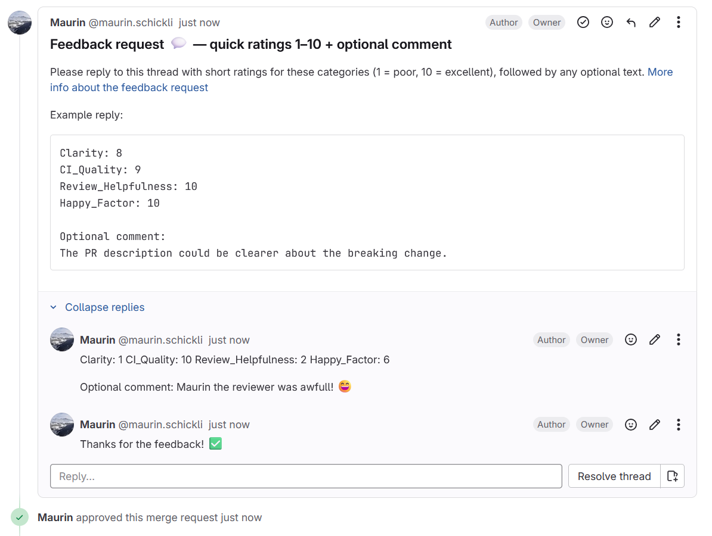

# GitLab Feedback Collector



Backend service that:

- Receives GitLab webhooks
- On MR approval, posts a discussion requesting quick 1–10 ratings per category
- Customizable categories
- Parses replies and stores feedback in SQLite

## Quick start

1. Copy env

```bash
cp .env.example .env
# Fill in GITLAB_BASE_URL, GITLAB_TOKEN, GITLAB_WEBHOOK_SECRET
```

2. Run

```bash
bun run dev
```

Health check: GET /health
Webhook endpoint: POST /webhooks/gitlab

## Configure GitLab Webhook

- URL: <https://your-domain/webhooks/gitlab>
- Secret Token: set to `GITLAB_WEBHOOK_SECRET`
- Events: Merge request events, Comments (note) events

## Development

- Tests: `bun test`
- DB: SQLite file at `DB_PATH` (default `./data/app.db`)
- Use ngrok or the `ports` extension from vscode to expose the server to the internet (you have to update the webhook URL in GitLab)

## Notes

- Stores only parsed fields + original comment HTML/text
- Ratings scale 1–10, categories configurable via `FEEDBACK_CATEGORIES`

## Docker

Build image:

```bash
docker build -t gitlab-feedback-collector .
```

Run (with persistent volume for SQLite DB):

```bash
docker run -d \
	-e GITLAB_BASE_URL=https://gitlab.example.com \
	-e GITLAB_TOKEN=yourToken \
	-e GITLAB_WEBHOOK_SECRET=yourSecret \
	-e PORT=3000 \
	-p 3000:3000 \
	-v feedback_data:/app/data \
	--name gitlab-feedback-collector gitlab-feedback-collector
```

Health check:

```bash
curl -f http://localhost:3000/health
```

Override categories (CSV or JSON array):

```bash
-e FEEDBACK_CATEGORIES="Clarity,Timeliness,CI_Quality,Review_Helpfulness"
```

Restrict to certain project IDs:

```bash
-e ALLOWED_PROJECTS="123,456" \
```

Optional bot identity (used for filtering own comments):

```bash
-e BOT_USERNAME=feedback-bot -e BOT_USER_ID=999999
```

Data persistence: The container declares a volume at `/app/data`; mount or use a named volume (as in the example) so feedback is retained across restarts.
